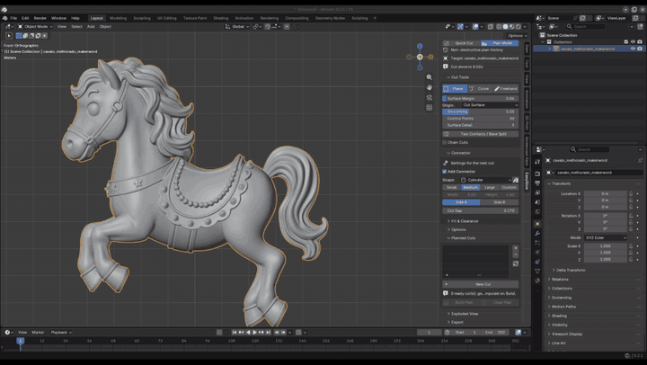

<h1 align="center">EasySlice Print</h1>

<p align="center">
  <strong>Corte. Encaixe. Imprima.</strong><br>
  Divisão não destrutiva de modelos e conectores personalizados para impressão 3D — add-on gratuito para Blender.
</p>

<p align="center">
  <a href="https://github.com/rafaelomodei/easySlicePrint/actions/workflows/ci.yml"></a>
  <a href="https://github.com/rafaelomodei/easySlicePrint/releases"></a>
  
  
  <a href="LICENSE"></a>
  <a href="CODE_OF_CONDUCT.md"></a>
</p>

<p align="center">
  <a href="https://rafaelomodei.github.io/easySlicePrint/"><strong>Site</strong></a> ·
  <a href="https://github.com/rafaelomodei/easySlicePrint/releases/latest"><strong>Download</strong></a> ·
  <em>English: see <a href="README.md">README.md</a></em>
</p>

> [!WARNING]
> **Versão alfa.** O EasySlice Print ainda está em desenvolvimento ativo. Espere bugs e arestas:
> um corte pode falhar ou sair errado em algumas malhas, e o add-on muda entre versões, então um
> plano salvo em uma versão pode não ser reconstruído da mesma forma na seguinte. Mantenha um
> backup do seu `.blend`, confira cada peça antes de imprimir e
> [abra uma issue](https://github.com/rafaelomodei/easySlicePrint/issues) quando algo der
> errado — é isso que leva o projeto até uma 1.0 estável.

<!-- TODO(media): grave a demo, coloque os arquivos em docs/media/ e descomente.
     A lista de capturas está em docs/media/README.md.
<p align="center"></p>
-->

|  |  |
|---|---|
| ✂️ **Corte qualquer modelo** | plano, curva ou laço livre — não só planos retos |
| 🔩 **Pinos e encaixes automáticos** | formas prontas ou suas próprias malhas de conector |
| 🧩 **Planeje vários cortes** | não destrutivo: edite, mova, desative, reconstrua — o original nunca é tocado |
| 🖨️ **Exporte peças prontas** | um STL/OBJ/FBX por peça, em milímetros |

```
1. Desenhe o corte  →  2. Gere os conectores  →  3. Exporte as peças
```

<!-- TODO(media): descomente quando docs/media/step-*.png existirem.
<p align="center">
  
  
  
</p>
-->

## Recursos

| | |
|---|---|
| **Plane Cut** (corte reto) | arraste uma linha no viewport → corte plano do tamanho da linha desenhada, não do modelo inteiro |
| **Curve Cut** (corte curvo) | desenhe uma linha curva sobre o modelo → o corte segue a linha atravessando o modelo, indo só um pouco além do traço |
| **Freehand Cut** (corte livre) | desenhe um laço fechado *em volta* da superfície (orbite enquanto desenha) → o laço é preenchido e vira a superfície de corte (pescoços, pulsos, qualquer lugar que um plano não alcança) |
| **Two Contacts / Base Split** | dois contatos cortados numa só operação (ex.: os dois pés numa base), cada um com o seu conector |
| **Quick Cut** | corte final imediato, sem histórico |
| **Plan Mode** | não destrutivo: planeje vários cortes, edite/desative/remova, mova planos e conectores, **Build** quando estiver pronto, **Back to Plan** para continuar editando, **Approve** para finalizar. O modelo original nunca é alterado |
| **Conectores** | pino + encaixe automáticos: Cilindro, Cônico, Hexagonal, Caixa ou **malhas próprias** da sua biblioteca; presets de tamanho ou largura/altura explícitas; folga (clearance); ponta assimétrica (encaixe mais fundo); escolha de qual lado leva o pino; mova/gire/escale o conector livremente |
| **Cut Gap (kerf)** | material removido ao longo do corte para as peças não se tocarem |
| **Remesh** | remesh voxel opcional das peças |
| **Vista explodida** | afasta as peças para inspecionar os conectores e volta |
| **Exportação** | um arquivo por peça — **STL, OBJ, FBX** — numa pasta, em milímetros |

Testado headless no Blender 4.2.23 LTS e 5.2.1 LTS (o CI roda os dois). Funciona em Windows, macOS e Linux.

## Instalação

1. Baixe `easy_slice_print-<versão>.zip` nas [releases](https://github.com/rafaelomodei/easySlicePrint/releases) ou gere com `scripts/build.sh`.
2. Blender → *Edit → Preferences → Add-ons → ⌄ (canto superior direito) → Install from Disk…* → escolha o zip.
3. Ative **EasySlice Print**. O painel fica na sidebar do 3D Viewport (`N`) → aba **EasySlice**.

## Início rápido

1. Use uma **cena em milímetros** (Scene Properties → Units → Unit Scale `0.001`, Length `Millimeters`)
   ou marque em *Preferences → EasySlice → Units → "1 unit = 1 mm"*.
2. Selecione uma malha **fechada e manifold**. Aplique escala e rotação (`Ctrl+A`). Use *Check Mesh* (ícone ✓) se tiver dúvida.
3. Escolha **Quick Cut** ou **Plan Mode**.
4. Clique em **Plane**, **Curve** ou **Freehand** e desenhe no viewport:
   * Plane: arraste uma linha atravessando o modelo (ou clique, clique). `Esc` cancela.
   * Curve: desenhe uma linha sobre o modelo cruzando toda a silhueta.

   O corte **Plane** tira a superfície do próprio modelo: a linha que você arrasta escolhe o
   plano e diz que partes dele cortar, e a superfície de corte é a seção transversal do modelo
   ali — exatamente a área por onde a peça vai ser cortada. Toda região que a sua linha cruza é
   cortada, e só essas: trace sobre uma perna do personagem e a outra fica intacta; arraste de
   ponta a ponta e a espada e as asas vêm junto. Se um corte avisar que a peça continua inteira,
   ele diz quantas regiões o plano cruza que a sua linha não pegou — as metades seguem unidas por
   elas, então passe a linha por cima delas também. Mova ou gire o preview no Plan Mode e a seção
   é refeita onde ele parar.

   O corte **Curve** segue o modelo do mesmo jeito: cada ponto do traço vai exatamente até onde
   vai o material embaixo dele, e só atravessa o bloco de material em que o traço está apoiado —
   passe sobre o braço da frente e o corpo atrás fica intacto. Um traço que sai do fim de um
   membro para no membro.

   O laço do **Freehand** já é desenhado sobre a superfície, então o laço preenchido já é a face
   de corte impressa. *Surface Margin* define o quanto a superfície do Curve avança além das
   pontas do traço.

   Nos três, o conector é o maior círculo que realmente cabe dentro da face de corte: fica onde o
   material é mais grosso e tem a largura que esse material permite.
   * Freehand: desenhe na superfície em volta do modelo. Solte o botão, orbite com o `botão do meio`
     para trazer o outro lado à vista e desenhe de novo — o laço continua entre as visões.
     O trecho do laço escondido atrás do modelo aparece esmaecido; o salto entre dois traços
     aparece pontilhado. `Ctrl+Z` (ou `Backspace`) desfaz o último traço. Feche o laço no ponto
     verde inicial — ele só fecha sozinho quando esse ponto está realmente visível — ou com
     `Enter` / `C` de qualquer ângulo.
5. Painel Connector: forma, tamanho, lado do pino, cut gap e o **Fit** do encaixe impresso.
6. **Plan mode**: selecione um corte na lista para editar — *Edit Cut Surface* (G/R/S nos planos, arraste
   pontos nas curvas; cada superfície de corte tem origem própria no seu centro, então `R` e `S` giram e
   escalam em torno dela — mude *Surface Origin* para *Target Object* se preferir o pivô do modelo), *Select Connector* e G/R/S, *Reset*, *Swap* do lado do pino. Desmarque **Ready** para
   deixar um corte fora do build, o olho esconde o preview, ✕ apaga.
7. **Build** → as peças aparecem em `ESP_Built_<nome>`. **Back to Plan** para mudar algo, **Approve** para finalizar.
8. **Exploded View** para conferir o encaixe, **Export** para gravar os arquivos.

**Encaixe impresso.** Defina *Printer Clearance* uma vez nas preferências do add-on (Edit ›
Preferences › Add-ons › EasySlice Print) — quanto de folga a sua impressora precisa entre o pino e
o encaixe, de cada lado. 0,1 mm serve para a maioria das impressoras FDM; imprima um encaixe de
teste e não mexa mais. Cada corte escolhe então o quanto quer apertado no **Fit**: *Press* (0,5×),
*Snug* (1×, o padrão), *Easy* (1,5×), *Loose* (2,5×) ou *Custom* para digitar a folga. O painel
mostra o quanto o encaixe fica mais largo que o pino — o dobro da folga, já que ela é deixada de
cada lado.

### Conectores personalizados

Clique no ícone de biblioteca ao lado de *Shape*. A coleção `ESP_Connectors` é criada com os modelos
padrão. Qualquer malha adicionada a ela aparece no menu Shape. Convenção: a malha cabe em
`x, y ∈ [-0.5, 0.5]`, `z ∈ [-1, 1]`; `z = 0` é a superfície de corte e `+z` é a ponta que entra no encaixe.
Conectores precisam ser rígidos (sem articulações).

## Requisitos e limitações

* **Alfa:** em desenvolvimento ativo. Bugs são esperados, a interface e os dados do plano ainda
  mudam entre versões, e nenhum corte deve ir para a impressora sem conferir as peças antes.
* Blender 4.2 – 5.2. Somente malhas fechadas e manifold; malhas abertas, auto-intersectadas ou quebradas geram booleanos errados.
* O tempo depende da quantidade de polígonos e do solver booleano (Preferences). O solver *Manifold*
  (Blender 4.5+) é usado automaticamente quando existe, *Exact* como fallback.
* Não é um analisador de imprimibilidade — espessura de parede, orientação, suportes e tolerâncias são por sua conta.

## Desenvolvimento

```bash
BLENDER=/caminho/para/blender scripts/run_tests.sh   # testes headless
BLENDER=/caminho/para/blender scripts/build.sh       # gera o zip em dist/
```

Veja [docs/ARCHITECTURE.md](docs/ARCHITECTURE.md) e [docs/FEATURES.md](docs/FEATURES.md). O site público fica em
[`website/`](website/) (Astro, publicado no GitHub Pages por `.github/workflows/pages.yml`).
Contribuições são bem-vindas — leia [CONTRIBUTING.md](CONTRIBUTING.md) e o [Código de Conduta](CODE_OF_CONDUCT.md).

## Licença

**GNU General Public License v3.0 ou posterior** (`GPL-3.0-or-later`) — livre para usar, estudar,
modificar e compartilhar, inclusive comercialmente, desde que os trabalhos derivados permaneçam sob
a mesma licença. Veja [LICENSE](LICENSE).

O EasySlice Print é um projeto independente. Não é afiliado, endossado nem derivado de nenhum add-on
comercial; nenhum código ou asset de terceiros está incluído.
